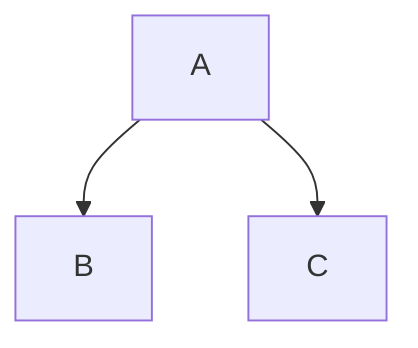

##### 일시 : 2022-09-16 22:45

# Title : 죽도록 열심히 산 한국인들에게 중요한 건 속도보단 방향!

### **Tag** : #1일1노트챌린지 #네트워크 #옵시디언 #어쩌다어른 #원바이원 #강연 #사회인지심리

### Memo

## 인고의 착각

| **능력(Capacity)** | **노력(Effort)** | **과제 특성(課題特性)** | **운(Luck)** |
| -------------- | ------------ | -------------- | -------------- |
| Internal       | Internal     | External       | External       |
| Uncontrollable | Controllable | Uncontrollable | Uncontrollable |
| Stable         | Unstable     | Stable         | Unstable       |

<iframe width="640" height="360" src="https://www.youtube.com/embed/BnGEx43QNbA" title="[#티전드] K-교육을 향한 허태균 교수의 팩폭💣 죽도록 열심히 산 한국인들에게 중요한 건 속도보단 방향! | #어쩌다어른" frameborder="0" allow="accelerometer; autoplay; clipboard-write; encrypted-media; gyroscope; picture-in-picture" allowfullscreen></iframe>

##### Source & Link
- [사피앤스 스튜디오 채널-1](https://youtu.be/BnGEx43QNbA)
- [사피앤스 스튜디오 채널-2](https://youtu.be/YUsuWPIbBus)
- [옵시디언 사용자모임 카페](https://cafe.naver.com/obsidianary/)
- [디지털 가든](https://chunghasull.netlify.app/220917-5일차-죽도록-열심히-산-한국인들에게-중요한-건-속도보단-방향)

##### Be Connected Document
- 

##### Backup

#### %%Footnote%%

[^1]: 