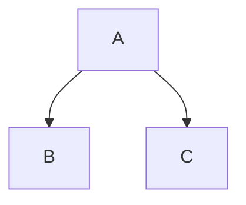

##### 일시 : 2022-09-16 22:45

# Title : 죽도록 열심히 산 한국인들에게 중요한 건 속도보단 방향!

### **Tag** : #1일1노트챌린지 #네트워크 #옵시디언 #어쩌다어른 #원바이원 #강연 #사회인지심리 #한국인

### Memo

# 목차
- 가족확장성
- 심정중심주의
- 복합유연성
- 불확실성회피
- 주체성 & 관계성

## 1. 가족확장성
- 가족을 사회의 중심으로 인식하고 사회체계를 가족적 속성으로 인식하는 경향

### 가족주의와 가족확장성

#### 가족주의
- 가족성의 의미는 베타적인 남미가 정답

#### 가족확장성
- 가족확장성은 우리나라의 유교적인 사상 때문
	- 군사부일체, 두사부일체, 투사부일체
- 자식이 죽으면 부모는 보통 자신을 책망한다.

### 식당에 가서 부르는 호칭
- 고모, 이모, 삼촌
- 사장님, 사모님

### 인고의 착각

#### 표
| **능력(Capacity)** | **노력(Effort)** | **과제 특성(課題特性)** | **운(Luck)** |
| -------------- | ------------ | -------------- | -------------- |
| Internal       | Internal     | External       | External       |
| Uncontrollable | Controllable | Uncontrollable | Uncontrollable |
| Stable         | Unstable     | Stable         | Unstable       |

##### 능력
- ###### 능력이 없으면 할게 없다?
- 능력이 있다면 원래 잘 봤기 때문에 잘한다고 인식한다. 
- 능력이 없다면 다음 시험에도 포기한다.

##### 과제특성
- 선생님이 미쳤나봐

##### 운
- 외부적인 영향을 받는다
- 통제가 불가능하다
- 불안정하다
	- 일에 대한 나쁜 경험을 했을 경우 다시 시도할 생각을 안 하게된다.
	- 일에 대한 좋은 경험을 했을 경우 다시 시도할 생각을 하게된다.
- 유일하게 도박은 예외, 착각을 하기 때문이다.

##### 노력
- 노력에 기인을 해야 성공한다고 생각하여 좋은 결과를 얻길 바라는 마음
- 노력만 강조를 한다면
	- 대학 합격 기원
	- 착각적 통제감 → 불안감 증폭
		→ 힘들고 어려운 시간을 보내수록 나중에 반드시 보상받을 거라는 믿음

###### 대한민국의 대표적인 사례
- 무조건적인 대학진학과 대기업 취업에 대한 딜레마를 사례예시로 들었다.
- 그리고 이것이 평범한 사람들의 가난이 대물림되는 근원이라고 설명하고 있다.
- (대안) 무조건 교육비 투자가 아닌 잘못된 방향으로 갔을 때를 대비해 비상금(?)을 모을 줄 알아야 한다.
- **속도가 아닌 방향**
	- 놀 줄 알아야 한다. → 다음 도약을 위한 나를 충전하는 방법

## 2. 심정중심주의
- 언제나 행동보다 마음이 먼저

### 서양인은 일관성이 있고 한국인은 없다?
- 욕쟁이 할머니를 예시로 우리나라는 진심이 없으면 넘어가주는 심리가 있다.
	- 그래서 우리나라는 3번 물어봐야한다는 말이 있다.

#### 서양인의 일관성
- 레온 페스팅거 ‘인지부조화 이론’[^1]

#### 한국인의 관계주의
- 정이 느껴진다?

##### 소통의 언어 vs 기술의 언어
- 밥 먹었니? 안 먹었니?
	- 영어권은 밥 먹었으면 Yes, 안 먹었으면 No)
	- 밥 먹었니? → 네 먹었어요. → 아니요 안 먹었어요.
	- 밥 안 먹었니? → 네 안 먹었어요. → 아니요 먹었어요.

##### (다니엘) 한국인은 페이크 언어를 사용한다.

###### (공공, 정부) 기술의 언어
- 정확한 통계와 수치를 사용
- 비교적 남성들이 기술의 언어를 많이 사용한다.

###### (일상) 소통의 언어

### 사랑합니다. 고객님 (고객센터 서비스를 예시)
- 고객을 진심으로 대하라는 우리나라 사회 → 감정노동
- 진심을 빌미로 끝없이 무리한 요구

### 동양인은 전부 집단주의다? 한국인과 일본인의 차이
- 일본은 집단주의 성향을 가지고 있고 한국은 관게주의 성향을 가지고 있다.
- 집단주의 사회에서는 집단 성격에 따라 차이가 있고, 관계주의 사회에서는 사람에 따른 차이가 있다.

## 3. 복합유연성

### 선택에 따른 포기가 힘든 한국인
- 양극적이고 직선적 관계보다는 순환적이고 복합적 관계로 인식하는 경향

### 이왕이면 다홍치마
- 일본의 사례로 일본인들은 대중교통을 이용 시 원래 서서가는 것이 일상이므로 서서가는 것을 감수한다. 한국은 상반되게 빈자리가 있으면 무조건 앉는 심리가 있다.
- 대표적으로 짬짜면은 한국인의 특성을 고려한 상품이다.

#### 오늘만 보고 사는 한국인
- 눈앞에 성공만 급급

### 우리나라의 기본적인 사법절차
- 무죄추정의 원칙[^2]
- 합리적 의심의 기준

#### 무처벌 오류
- 무처벌 오류를 피하기 위해선 유죄 선고를 많이한다.
	- 무고한 사람에게 유죄를 선고하는 처벌 오류가 늘어남
- 처벌 오류를 피하기 위해서 무죄 선고를 많이 한다면
	- 진범이 풀려나는 상황이 발생

##### 무처벌 오류 회피 vs 처벌 오류 회피 (조사)
- 판사
	- 무처벌 오류를 회피 : 24[%]
	- 처벌 오류를 회피 : 76[%]
- 일반인
	- 무처벌 오류를 회피 : 49[%]
	- 처벌 오류를 회피 : 51[%]

## 4. 주체성
- 자신의 존재감과 영향력을 확인하려는 성향

### 서양인들의 주체성

#### 자율성
- 서양문화권 : 개인의 자유, 권리, 신호 등을 중시
- 동양문화권 : 집단 속의 조화, 화합 등을 중시

##### 서양, 한국, 일본
- 서양 >>> 한국, 일본

### 동양인들의 주체성

#### 한국인의 주체성 이란?
- 한국은 주체성이 강한데 스스로 존재감을 인정하지 않고 타인에게 인정받으려는 심리가 크다.
- 한턱 쏜다. (특별한 날에 주인공이 되고 싶을 때, 본인의 존재감을 부각시키고 싶을 때)

##### 한턱 쏜다 vs 접대
- 한턱 쏠 때는 본인의 존재감을 부각시키지만 접대할 때는 본인의 존재감을 죽여야한다.

#### 서열사회
- 한국 서열 사회 : 주인공이 누군지 파악
- 일본 서열 사회 : 조직 속 내 위치 파악

#### 비현실적인 낙관주의
- 자기존중감은 큰 차이가 없다.
- 비현실적 낙관성은 한국이 가장 크고 일본이 가장 낮았다.

#### 사진찍는 스타일이 서양과 한국이 다르다?
- 서양인의 사진이란 기억을 재생하게 도와주는 도구
- 한국인의 사진이란 사람 위주, 주인공 의식 즉, 자신의 흔적을 남기는 행위로 쓴다

#### 생각하기와 말하기
- 생각하기 좋아하는 한국, 본인의 판단 하에 일을 진행한다.
- 한국인은 자기 의견을 강하게 표현한다.
	- 저신뢰사회? 준법의식이 낮다?
		- 특별한 주체성을 가지고 있어서 그렇다?
- 원칙주의 일본, 생각과 표현을 잘 안 한다.
- 일본인은 자기 스스로 생각하길 좋아하지 않는다.

#### 150[%]까지 사용하는 한국인
- 제품을 최대 효율까지 끌어올려 사용
- 유례없는 경제발전

#### 강한 주체성 때문에 갑질의 근원이 된다
- 힘의 불균형에서 나오는 갑질이 한국인의 특유한 주체성과 관계성 때문에 무분별하게 나온다.
	- 이러한 악순환은 무기력과 분노로 만들게 한다.

## 5. 결론

### 주인공으로 사는 법
- 자신을 인정하자, 자신에게 인정해 줄 사람을 찾자.
- 다른 사람이 나를 어떻게 대하고 있는 가보다는 이제는 스스로를 인정하는 지혜가 필요하다.
- 더불어 어떤 가치를 가지고 어떤 방향으로 나아가야 하는지 함께 고민하고 인정해줄 사람이 주위에 있다면 지금보다 더 행복해질 수 있지 않을까?

## 마무리
- 어쩌다어른은 시각적인 자막구현과 편집된 분량을 보여주므로 문헌 메모로 다시 한 번 작성하는 것은 맞지 않는 것 같다. (이번주제에만 그럴 수도)
	- (대안) 풀버전 다시보기를 전 회차 시청 후 나의 생각을 위주로 글쓰기
- 생각하는 글쓰기가 아니기 때문에 실패한 글쓰기를 작성한 거 같다.
- 강연 주제를 선정 시 단순히 흥미로운 주제보다 제텔카스텐 글쓰기에 적합한 주제를 우선

> [!done]- 동영상
> <iframe width="640" height="360" src="https://www.youtube.com/embed/BnGEx43QNbA" title="[#티전드] K-교육을 향한 허태균 교수의 팩폭💣 죽도록 열심히 산 한국인들에게 중요한 건 속도보단 방향! | #어쩌다어른" frameborder="0" allow="accelerometer; autoplay; clipboard-write; encrypted-media; gyroscope; picture-in-picture" allowfullscreen></iframe>
> <iframe width="640" height="360" src="https://www.youtube.com/embed/YUsuWPIbBus" title="[#티전드] 인고의 착각에 빠진 한국 사회😥 말처럼 다 되지 않는 냉혹한 현실 속에서 이제는 속도가 아닌 방향에 집중해야 할 때🔥 | #어쩌다어른" frameborder="0" allow="accelerometer; autoplay; clipboard-write; encrypted-media; gyroscope; picture-in-picture" allowfullscreen></iframe>
> <iframe width="640" height="360" src="https://www.youtube.com/embed/VQeI9CgFRao" title="[#티전드] '30일 무료체험' 처럼 우리가 공짜라고 생각하는 것들이 사실 공짜가 아니다❓ 후회와 만족이 공존하는 삶을 사는 법 | #어쩌다어른" frameborder="0" allow="accelerometer; autoplay; clipboard-write; encrypted-media; gyroscope; picture-in-picture" allowfullscreen></iframe>

##### Source & Link
- tvN 유퀴즈온더블럭 E155
- tvN 어쩌다어른 E71, 73, 74, 75
- [tvN D ENT 채널-1](https://youtu.be/RD6cBcjG_K8)
- [tvN D ENT 채널-2](https://youtu.be/BnGEx43QNbA)
- [tvN D ENT 채널-3](https://youtu.be/YUsuWPIbBus)
- [tvN D ENT 채널-4](https://youtu.be/VQeI9CgFRao)
- [사피앤스 스튜디오 채널](https://youtu.be/TWwH43-H408)
- [유퀴즈온더블럭 + 어쩌다어른](https://youtu.be/09Z6u55ZQMQ)
- [옵시디언 사용자모임 카페](https://cafe.naver.com/obsidianary/1724)
- [디지털 가든](https://chunghasull.netlify.app/220917-5일차-죽도록-열심히-산-한국인들에게-중요한-건-속도보단-방향)

##### Be Connected Document
- [[220916-[4일차] 영어 잘하는 방법 뻔뻔함을 가져라!]]
- [[220918-[6일차] 그 많던 아이들은 어디로 갔을까]]

##### Backup

#### %%Footnote%%

[^1]: 자신의 생각과 행동에 일관성을 유지하려는 욕구
[^2]: 유죄 확정판결 전까지는 무죄로 추정